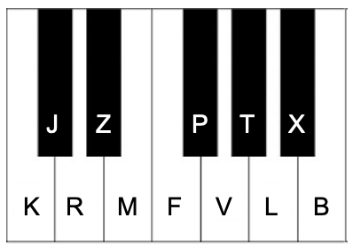

# Sistema Vakam
Sistema silábico de representação harmônica.

Este sistema foi desenvolvido por Wagner Candian como uma proposta original de representação harmônica baseada em sílabas fonéticas. A ideia surgiu a partir da vontade de digitar cifras e progressões de canções de forma mais rápida no celular, sem ter que utilizar números, barras e simbolos diversos.

---

## Como funciona o Sistema Vakam 

O Sistema Vakam transforma cada acorde em uma sílaba.

Conforme a imagem acima, as consoantes representam a fundamental do acorde.

O tipo de acorde vai depender da vogal que vem a seguir. Cada vogal indica um tipo de acorde:

 A = maior  
 E = menor   
 I = dominante    
 O = diminuto   
 U = meio diminuto (m7♭5)

  Exemplos:

  Ka = C  
  Ki = C7   
  La = A  
  Li = A7  
  Pe = F#m  
  Pu = F#m7(b5)

As mesmas consoantes podem ser adicionadas como sufixos no final da sílaba para apontar o baixo. Exemplos:

Kam = C/E 

Jem = C#m/E 

Pax = F#/A#  

Mat = E/G#

---

Exemplo de Progressão:

Ka – Vi – Le – Fa = C – G7 – Am – F

La - Mat - Pe MA = A E/G# F#m E

---

## Por que usar o Vakam?

- Escrita mais rápida (Se você for digitar por exemplo, não usa numeros nem barras etc...)
- Leitura fonética econômica 
- Comunicação mais eficiente entre músicos

---

## Documentação Completa

📄 [Consulte a documentação completa em PDF para conhecer todas as possibilidades do sistema](sistema-vakam.pdf)

---

💬 Feedback e sugestões são bem-vindos na aba Issues.

---

## Histórico de Versões

- 1.0 – Formalização inicial do sistema.

---

## Licença

Uso livre para fins educacionais e musicais, com preservação da autoria.
